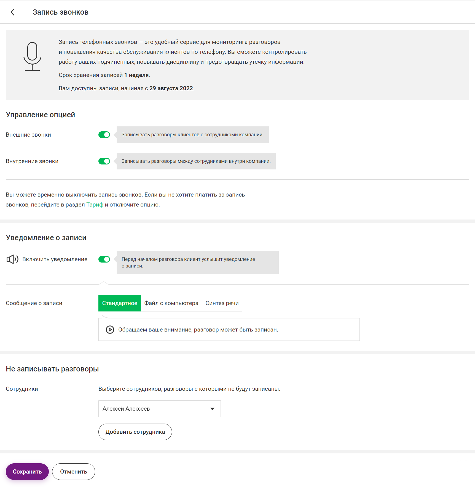
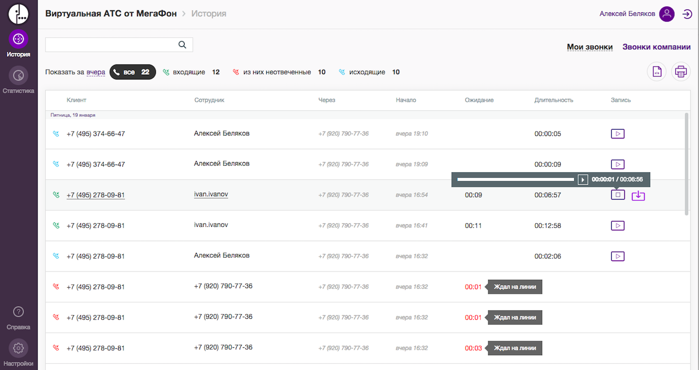
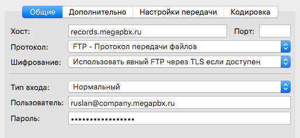
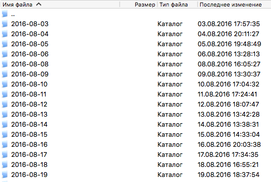

# Coral Travel Челябинск — отдельная инструкция только по телефонии МегаПБХ

Этот файл можно переслать сотруднику, который не может быстро найти нужные пункты в МегаПБХ.

## Короткий ответ на 3 вопроса

Сначала важное: у МегаПБХ, похоже, есть несколько вариантов интерфейса. Поэтому старые шаги вида `Настройки → Запись разговоров → Формат записи` могут быть верными для одного кабинета и отсутствовать в другом.

### 1. Где включается запись звонков?

Идите в:

```text
Настройки → Еще → Запись звонков
```

Если у вас вместо этого есть раздел:

```text
Настройки → Запись разговоров
```

значит у вас другой вариант интерфейса, и тогда настройки `Формат записи`, `Запись всех вызовов`, `Хранение` могут быть вынесены именно туда.

На этом экране ищите:
- `Внешние звонки` — это запись всех клиентских входящих и исходящих звонков
- `Внутренние звонки` — это запись звонков между сотрудниками
- `Уведомление о записи` — предупреждение для клиента
- верхний серый блок со строкой `Срок хранения записей ...` — здесь видно, сколько записи живут в системе



### 2. Где смотреть запись всех вызовов?

Идите в:

```text
История
или
Контроль продаж → История и запись звонков
```

На этом экране ищите:
- вкладку `Звонки компании`
- список всех вызовов
- колонку `Запись` с кнопкой прослушивания



### 3. Где хранение?

В публичной справке МегаПБХ отдельного меню `Хранение` я не нашёл. В интерфейсе срок хранения показывается прямо на странице `Запись звонков` в верхнем информационном блоке.

Если нужно хранить записи дольше встроенного срока, МегаПБХ позволяет забирать архив по FTP:

- сервер: `records.megapbx.ru`
- логин: полный логин администратора, например `admin@company.megapbx.ru`
- пароль: пароль этого администратора



После входа записи лежат в папке `recordings`, разбитые по датам:



## Где искать именно "формат записи"

По публичной справке МегаПБХ я вижу экран `Запись звонков`, но не вижу отдельного публичного скриншота или статьи, где явно есть переключатель `Формат записи: Моно / Стерео`.

Поэтому ориентир такой:

1. Откройте `Настройки → Еще → Запись звонков`.
2. Если там нет нужных полей, проверьте, нет ли у вас отдельного раздела `Настройки → Запись разговоров`.
3. Если поле `Формат записи` есть, нужно выбрать `Стерео`.
4. Если поля нет ни в одном из вариантов, значит нужно уточнить у поддержки МегаПБХ или у персонального менеджера:
   `Доступна ли для аккаунта coral-travel.megapbx.ru двухканальная (stereo) запись разговоров и где она включается?`

Почему это важно:
- `Моно` = менеджер и клиент смешаны в один канал
- `Стерео` = можно разделять речь менеджера и клиента и делать нормальный контроль качества

## Если у вас нет пунктов "Формат записи" и "Хранение"

Это не значит, что вы смотрите не туда.

Что видно по официальной справке МегаПБХ:
- стандартный путь для записи звонков: `Настройки → Еще → Запись звонков`
- на этом экране точно есть включение записи внешних звонков
- на этом экране может отображаться строка `Срок хранения записей ...`
- отдельные пункты меню `Формат записи` и `Хранение` в публичной справке не показаны

Поэтому правильная логика такая:

1. Если видите `Внешние звонки` и `Уведомление о записи` — вы уже в нужном разделе.
2. Если не видите `Формат записи`, не нужно его дальше искать по всему кабинету.
3. Если не видите отдельное `Хранение`, ориентируйтесь на строку `Срок хранения записей ...` в верхнем блоке.
4. Если нужен именно `стерео`-формат или другой срок хранения, это надо уточнять у поддержки МегаПБХ по вашему тарифу и аккаунту.

Короткий вывод:
- `Запись всех вызовов` в вашем интерфейсе это, скорее всего, переключатель `Внешние звонки`
- отдельного меню `Хранение` у вас может не быть
- отдельного поля `Формат записи` у вас тоже может не быть

## Что включить в первую очередь

Минимум для работы аналитики:

1. `Внешние звонки` = включены
2. Срок хранения записей проверен
3. Подтверждено, что запись можно получать в `стерео` или `двухканальном` формате
4. Есть доступ к истории звонков и к самим аудиозаписям

## Важное ограничение

В официальной справке МегаПБХ указано, что в истории есть все звонки сотрудников, кроме исходящих звонков с собственных SIM-карт. Если менеджеры звонят клиентам мимо ВАТС со своих мобильных, эти разговоры не попадут в общий контроль автоматически.

## Если не получается найти пункты

Официальная поддержка МегаПБХ:
- телефон: `8 (800) 550-22-87`
- email: `vats@megafon.ru`
- время работы: `9:00–18:00 МСК`

Готовый текст для отправки в поддержку:

```text
Здравствуйте. Подскажите, пожалуйста, в аккаунте coral-travel.megapbx.ru:
1) где включается запись всех внешних звонков,
2) где видно срок хранения записей,
3) доступна ли двухканальная / stereo-запись разговоров и где включается этот формат.
```

## Источники

- Официальная справка МегаПБХ: [Запись звонков](https://www.megapbx.ru/record)
- Официальная справка МегаПБХ: [История и запись звонков](https://www.megapbx.ru/en/history_records)
- Официальная справка МегаПБХ: [Помощь по настройке Виртуальной АТС](https://www.megapbx.ru/help)
